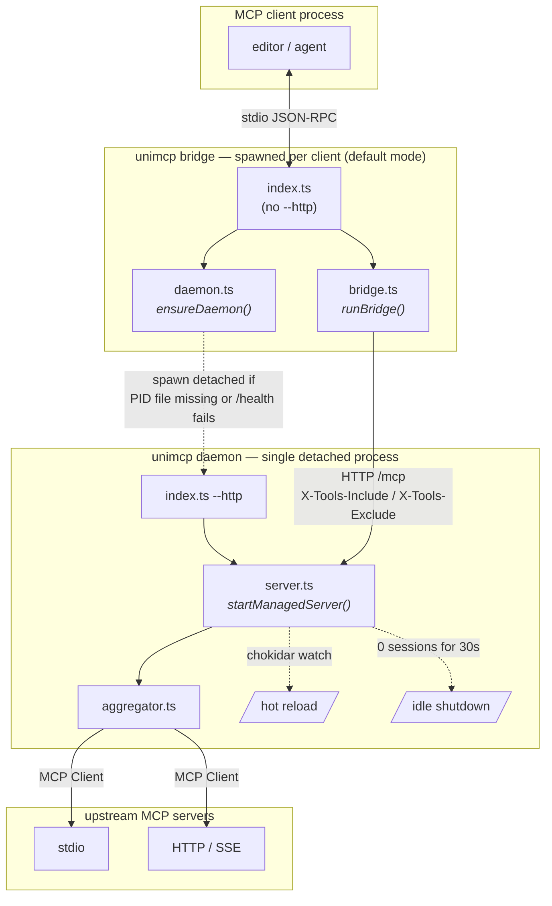

# AGENTS.md — unimcp

Coding agent reference for the **unimcp** repository: a TypeScript MCP aggregator that merges multiple upstream MCP servers into a single stdio/HTTP endpoint.

---

## Project layout

```
src/
  index.ts        # Commander CLI entry — routes to bridge, daemon, server, setup, collect, mcp/status/stop
  config.ts       # Config types, loader, ${VAR} expansion (skips servers with unset vars), env-hash, pidFilePath helper, header constants
  aggregator.ts   # Upstream client manager — connect, merge tools, route calls, in-flight reconnect
  server.ts      # Managed HTTP daemon — /health /status /mcp, sessions, idle shutdown, hot reload, port fallback
  daemon.ts       # Daemon spawn / supervisor — detached process, PID file, health-check loop
  bridge.ts       # Stdio ↔ HTTP bridge (default mode) — auto-reconnect, forwards UNIMCP_INCLUDE/EXCLUDE as headers
  setup.ts        # `setup` command — register unimcp in client configs
  collect.ts      # `collect` command — read MCP configs from all clients, merge, output
  status.ts       # `status` command — list running daemons + loaded tools
  stop.ts         # `stop` / `restart` commands — kill by ID prefix, current context, or --all
  mcp.ts          # `list` / `get` / `add` / `add-json` / `remove` server CRUD
  mcp-format.ts   # CLI pretty-printer for server entries
  utils.ts        # Shared utilities (log, writeFileSafe, tryUnlink, identity constants, glob splitters)
bin/
  unimcp.js       # npm launcher: dynamic-imports dist/unimcp.js (the bundled output)
tests/
  *.test.ts       # Unit tests (bun test) — aggregator, config, setup, utils
.github/
  workflows/
    ci.yml        # Type check + unit tests on push/PR to main
    codeql.yml    # CodeQL static analysis
    scorecard.yml # OSSF Scorecard
unimcp.json       # Server config (gitignored — user-created, not committed)
.env              # Secrets (gitignored)
tsconfig.json     # Strict ESNext, moduleResolution: Bundler, noEmit
package.json      # pnpm project, scripts below
```

### Architecture at a glance

Three process types. `index.ts` is the single binary entrypoint; CLI flags decide which role it plays.



- `index.ts` parses CLI and dispatches: default = `ensureDaemon → runBridge`; `--http` = `startManagedServer` (the daemon itself).
- `daemon.ts` runs **in the bridge process** as a client-side supervisor. It reads the PID file at `~/.config/unimcp/daemon.<envHash>.pid`, probes `/health`, and `spawn`s a detached `index.ts --http` process if nothing is alive.
- `server.ts` runs **in the daemon process** — owns the HTTP listener, session counter, hot reload, idle shutdown, and writes the PID file once it's bound to a port.
- `aggregator.ts` holds the upstream `Client` instances and merges their tools as `serverName__toolName`. It is owned by `server.ts` and swapped wholesale on config reload.
- `bridge.ts` connects to the daemon with `StreamableHTTPClientTransport`, retries with cooldown on transport errors, and re-invokes `ensureDaemon` if the daemon has died.

---

## Commands

```bash
# Development (no compile step — bun runs TS natively)
pnpm dev            # stdio mode: ensure daemon + bridge
pnpm http           # HTTP mode: managed server on :4848
pnpm daemon         # alias for --http (explicit daemon invocation)
pnpm collect        # print merged config from all editors to stdout
pnpm register       # register unimcp in Claude Code, Copilot, OpenCode, Cursor

# Type checking and tests
pnpm typecheck      # tsc --noEmit — must pass before any commit
pnpm test           # bun test tests/ — run unit tests

# Build & install compiled binary
pnpm build          # bun build --compile --minify → dist/unimcp
pnpm install-bin    # build + cp dist/unimcp /usr/local/bin/unimcp
```

There are no automated integration tests. The canonical verification steps are:

1. `pnpm typecheck` — zero errors required
2. `pnpm test` — all tests must pass
3. Manual smoke test: `printf '{"jsonrpc":"2.0","id":1,"method":"tools/list","params":{}}\n' | timeout 20 pnpm dev 2>/dev/null`

---

## TypeScript conventions

### Module system

- **ESM only** — `"type": "module"` in `package.json`
- All local imports use `.js` extension even for `.ts` source files:
  ```ts
  import { loadConfig } from './config.js'; // ✅
  import { loadConfig } from './config.ts'; // ❌
  import { loadConfig } from './config'; // ❌
  ```
- SDK imports use deep paths with `.js`:
  ```ts
  import { Client } from '@modelcontextprotocol/sdk/client/index.js';
  import type { Tool } from '@modelcontextprotocol/sdk/types.js';
  ```

### Import ordering

1. Node built-ins (`fs`, `http`, `child_process`, `path`)
2. Third-party packages (`chokidar`, `minimatch`, SDK)
3. Local files (`./config.js`, `./aggregator.js`)

Use `import type` for type-only imports.

### TypeScript strictness

- `strict: true` — no implicit any, strict null checks, etc.
- All function parameters and return types must be inferrable; explicit annotations where inference is insufficient
- Unused destructured variables prefixed with `_` (e.g., `{ upstreamName: _u, ...tool }`)
- Use `ReturnType<typeof X>` over manually duplicating types (e.g., `ReturnType<typeof setTimeout>`)

### Types and interfaces

- Use `type` aliases, not `interface`, for object shapes
- Export types with `export type`; never export bare `interface`
- Union types for discriminated variants: `type ServerConfig = StdioServer | HttpServer`
- Type guards via explicit functions: `function isHttpServer(s: ServerConfig): s is HttpServer`
- Options objects for functions with more than 2 parameters:
  ```ts
  // ✅
  export async function startManagedServer(
    opts: ManagedServerOptions,
  ): Promise<void>;
  // ❌
  export async function startManagedServer(
    port: number,
    host: string,
    configPath: string,
  );
  ```

---

## Code style

### File size

- Each file has a single clear responsibility
- Keep files under ~150 lines; extract helpers when approaching that limit

### Function design

- Functions do one thing; max ~50 lines
- Early return to reduce nesting — avoid deep if/else chains
- **Flow functions** only coordinate; zero domain logic
- **Worker functions** execute one task; never acquire a second responsibility
- Helper functions that are not part of a public API go below a `// --- helpers ---` comment at the bottom of the file

### Naming

- `camelCase` for variables, functions, parameters
- `PascalCase` for types and classes
- `SCREAMING_SNAKE_CASE` for module-level constants: `const IDLE_TIMEOUT_MS = 30_000`
- Prefix unused destructure bindings with `_`
- Boolean variables: `is*`, `has*`, `use*` prefixes

### Numeric literals

- Use `_` separators for readability: `30_000`, `3_000`

### Async/await

- Always `await` Promises; never fire-and-forget unless intentionally detached (daemon spawn)
- Concurrent independent work: `await Promise.all([...])`, not sequential awaits
- `.catch()` only at the top-level entry point (`main().catch(...)`)

---

## Error handling

- On error: **either return it or log it — never both, never omit**
- If the error breaks the flow → throw/return
- If the flow continues despite the error → `console.error(...)` and continue
- Upstream connection failures are non-fatal (logged, server skipped):
  ```ts
  } catch (err) {
    console.error(`[${name}] failed to connect:`, err);
  }
  ```
- MCP protocol errors are wrapped in `McpError`:
  ```ts
  throw new McpError(ErrorCode.InternalError, String(err));
  ```

---

## Logging

- **All logs go to `stderr`** (`console.error`) — stdout is reserved for MCP JSON-RPC messages
- Log prefix convention: `[moduleName]` e.g. `[server]`, `[daemon]`, `[bridge]`, `[context7]`
- Never use `console.log`

---

## MCP SDK patterns

### Server (per-request, stateless HTTP mode)

```ts
const server = new Server({ name, version }, { capabilities: { tools: {} } });
// capabilities: { tools: {} } MUST be set at construction for tools to work
server.setRequestHandler(ListToolsRequestSchema, async () => ({ tools: [...] }));
server.setRequestHandler(CallToolRequestSchema, async (req) => { ... });
const transport = new StreamableHTTPServerTransport({ sessionIdGenerator: undefined });
await server.connect(transport);
await transport.handleRequest(req, res);
```

### Client (upstream)

```ts
const client = new Client({ name, version });
await client.connect(
  new StreamableHTTPClientTransport(new URL(url), { requestInit: { headers } }),
);
// or
await client.connect(new StdioClientTransport({ command, args, env }));
```

### Tool naming

- Aggregated tools use `serverName__toolName` (double-underscore separator)
- The separator constant is `SEP = "__"` in `aggregator.ts`
- Parse with `indexOf(SEP)` + `slice`, not `split`, to handle tool names that also contain `__`

---

## Key architectural rules

- `unimcp.json` is **gitignored** — never commit it; it is user-local
- `.env` is **gitignored** — no longer auto-loaded; secrets must be set in the shell environment before launching unimcp. `${VAR}` in `unimcp.json` is expanded from `process.env` at load time; a server referencing an unset or empty var is **skipped entirely** (no fallback, no partial config) — see `loadConfig()` vs `loadRawConfig()` in `config.ts`.
- Config resolution order: `./unimcp.json` (local cwd) > `--mcp-file` flag / `UNIMCP_CONFIG` env > `~/.config/unimcp/unimcp.json` (global default). The `DEFAULT_MCP_FILE` exported from `config.ts` points to the global path; local resolution is in `resolveMcpFile()` in `index.ts`.
- Daemon pid files live at **`~/.config/unimcp/daemon.<envHash>.pid`** (not in cwd)
  - `envHash` is an 8-char lowercase hex SHA-256 over `JSON.stringify({ __config: <abs path of unimcp.json>, ...sorted ${VAR} → process.env[VAR] map })` — see `computeEnvHash()` in `config.ts`
  - **Both inputs matter**: a different config file path *or* a different resolved value for any referenced env var produces a distinct hash → distinct daemon
  - Variables referenced but unset resolve to `""` for hashing (they still contribute to the hash, even though the owning server is skipped at load); unreferenced env vars are ignored
  - Format: `"<pid>:<port>"` e.g. `"94663:4848"` or `"94844:52341"` (after port fallback)
  - `pidFilePath(envHash)` in `config.ts` is the single source of truth for the path; called from both `server.ts` and `daemon.ts`
  - Each distinct env context spawns its own isolated daemon; clients sharing the same env hash reuse one daemon

### Key constants
```
DEFAULT_MCP_FILE = ~/.config/unimcp/unimcp.json          (config.ts)
CONFIG_DIR       = ~/.config/unimcp                     (server.ts)
PID_FILE         = ~/.config/unimcp/daemon.<envHash>.pid (computed in server.ts / daemon.ts)
SYSTEM_BIN_PATH  = /usr/local/bin/unimcp                (setup.ts)
CLIENT_NAME      = "unimcp"                              (aggregator.ts)
CLIENT_VERSION   = "1.0.0"                              (aggregator.ts)
SPAWN_WAIT_S     = SPAWN_WAIT_MS / 1_000                (daemon.ts)
SEP              = "__"                                 (aggregator.ts)
```

- The daemon is a **shared background process** — `pnpm dev` bridges to it rather than spawning upstreams per client
- **Auto port fallback**: server tries `preferredPort` (default 4848); if `EADDRINUSE`, falls back to port 0 (OS-assigned); actual port written to pid file so bridge always discovers the right port
- `StreamableHTTPServerTransport` must be created **per request** (stateless: `sessionIdGenerator: undefined`)
- Upstream stdio servers inherit `{ ...process.env, ...srv.env }` — merge, not replace
- Reconnect on hot-reload: disconnect old aggregator before replacing with new one

### Per-client tool filtering

- Client-side filtering is controlled via environment variables on the bridge process:
  - `UNIMCP_INCLUDE` — comma-separated glob patterns (only matching tools visible)
  - `UNIMCP_EXCLUDE` — comma-separated glob patterns (matching tools hidden)
- The bridge reads these env vars and forwards them as `X-Tools-Include` / `X-Tools-Exclude` HTTP headers to the daemon
- The daemon parses these headers into a `ToolFilter` and passes it to `aggregator.listTools(clientFilter?)`
- `aggregator.listTools(clientFilter?)` applies both the per-server filter (from `srv.include`/`srv.exclude`) AND the client filter (both must pass)
- Clients without filter env vars see all tools (open default)
- Direct HTTP callers (not via bridge) can set `X-Tools-Include` / `X-Tools-Exclude` headers directly

### Per-server tool filtering

- Each server in `unimcp.json` can have optional `include` and `exclude` fields (flat, not nested)
- These are glob patterns applied to tool names before aggregation
- Example: `"include": ["search_*"], "exclude": ["search_internal"]`

### Server enabled/disabled

- Each server config supports an optional `enabled` field (default: `true`)
- Set `"enabled": false` to skip a server without removing its config
- Disabled servers are filtered out in `aggregator.connect()` before any connections are made

---

## Collect command

`unimcp collect` reads MCP server configs from all installed editors and merges them.

```bash
unimcp collect                       # print merged config to stdout
unimcp collect -o out.json           # write to a file
unimcp collect --save                # write to ~/.config/unimcp/unimcp.json (default mcp-file)
unimcp collect --save --mcp-file /path/to/unimcp.json  # write to a custom file
```

Sources (in order, last-write-wins on name collision):
1. Claude Code user scope (`~/.claude.json` → `mcpServers`)
2. Claude Code project scope (`.mcp.json` in cwd → `mcpServers`)
3. Cursor global (`~/.cursor/mcp.json` → `mcpServers`)
4. VS Code / Copilot global (`~/Library/.../Code/User/mcp.json` → `servers`, remapped)
5. OpenCode global (`~/.config/opencode/opencode.json` → `mcp`, remapped, enabled only)
6. `.mcp.json` in cwd (same file as Claude Code project scope — deduplicated naturally)

Output format: `{ "mcpServers": { ... } }` — directly usable as unimcp's unimcp.json.

---

## Setup / registration

`unimcp setup` (or `pnpm register`) registers the binary in editor configs:

**Local mode (default):** writes to `.mcp.json` (claude), `.cursor/mcp.json` (cursor), `.vscode/mcp.json` (copilot) in the current directory. Always creates/updates.

**Global mode (`--global`):** writes to user-level config files. Only updates if the config file already exists. Use `--target` to force-create.

| Target            | Local path (cwd)    | Global path                                      | Key          | Type value         |
| ----------------- | ------------------- | ------------------------------------------------ | ------------ | ------------------ |
| `claude`          | `.mcp.json`         | `~/.claude.json`                                 | `mcpServers` | _(implicit stdio)_ |
| `cursor`          | `.cursor/mcp.json`  | `~/.cursor/mcp.json`                             | `mcpServers` | _(implicit stdio)_ |
| `copilot`         | `.vscode/mcp.json`  | `~/Library/.../Code/User/mcp.json`               | `servers`    | `"stdio"`          |
| `opencode`        | _(none)_            | `~/.config/opencode/opencode.json`               | `mcp`        | `"local"`          |

- **Dedup**: skips a target if `"unimcp"` key already exists
- **`--global --target=claude,copilot`**: force-write global even if file doesn't exist
- OpenCode has no project-level equivalent (global only)

---

## npm package

- **Package name**: `@dandehoon/unimcp` (scoped, public)
- **`bin`**: `./bin/unimcp.js` — thin Node.js launcher that dynamic-imports `dist/unimcp.js` (the bundled output)
- **`files`**: `src/`, `bin/`, `dist/unimcp.js`, `README.md`, `SECURITY.md` — `dist/unimcp.js` must exist at publish time or the installed `bin/unimcp.js` will fail at import
- **`publishConfig`**: `{ "access": "public" }`

### Release process (manual — no CI publish)

Auto-publish via GitHub Actions was removed (commit `41aec64`). Releases are now driven by a human.

```bash
# 1. Bump version in package.json (semver)
# 2. Verify clean
pnpm typecheck && pnpm test

# 3. Commit, tag (signed), push
git commit -am "chore: release vX.Y.Z"
git tag -a vX.Y.Z -m "vX.Y.Z"
git push && git push --tags

# 4. Build bundle + publish (requires `npm login` with publish rights)
pnpm bundle                       # produces dist/unimcp.js
pnpm publish --no-git-checks
```

Recommended hardening: add `"prepublishOnly": "pnpm bundle"` to `package.json` scripts so the bundle is always rebuilt before publishing — otherwise a forgotten `pnpm bundle` ships a package whose `bin` import resolves to nothing.

---

## Before committing

```bash
pnpm typecheck   # must be clean (zero errors)
pnpm test        # all tests must pass
```
