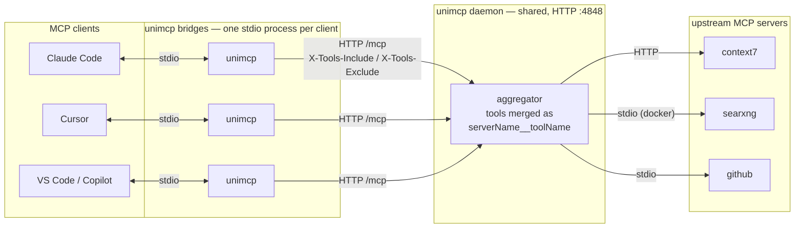
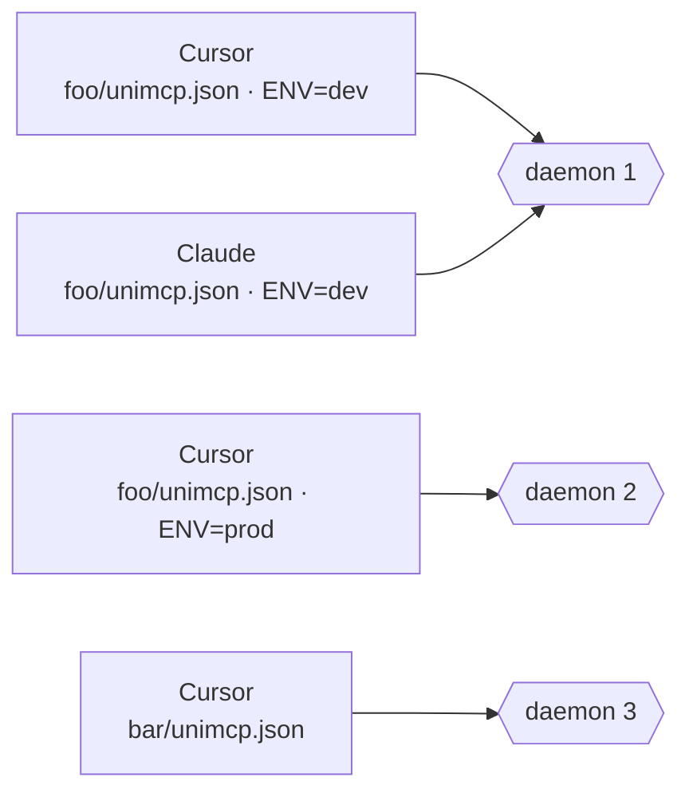

# unimcp

A local MCP aggregator. One config, one daemon, per-client tool control.

## Why

MCP clients duplicate config. Every client that speaks MCP (Claude Code, Cursor, VS Code, OpenCode, custom agents) needs its own copy of the same server definitions. Change a server, update N configs.

Centralized MCP servers solve duplication but create a new problem: tool visibility is controlled server-side. You either expose everything, or manage static profiles in the server config. Switching what a client sees means editing the server.

Docker-based MCP servers add another pain point: poor lifecycle management. Stdio containers can hang indefinitely, orphaned processes pile up, and there's no shared daemon to manage them.

unimcp fixes these:

- **One config** — define all MCP servers in a single `unimcp.json`. Every client connects through unimcp.
- **Auto daemon** — a shared background process manages all upstream connections. Auto-spawns on first use, auto-shuts down after 30s idle, hot-reloads on config change. No orphaned Docker containers or zombie stdio processes.
- **Client-side tool control** — because clients share a daemon, each one can declare what tools it sees via `UNIMCP_INCLUDE`/`UNIMCP_EXCLUDE` env vars. No server-side profiles to manage.
- **Per-secret isolation** — different `${VAR}` values (e.g. distinct `GITHUB_TOKEN`s) automatically get separate daemon instances.

See [Architecture](#architecture) for the full picture.

## Quick start

### 1. Install

```bash
npm install -g @dandehoon/unimcp
```

Or run directly without installing:

```bash
npx @dandehoon/unimcp
```

### 2. Create config

Add servers via CLI (similar to `claude mcp`):

```bash
unimcp add context7 --type http --url https://mcp.context7.com/mcp
unimcp add searxng --command docker --args "run,-i,--rm,dandehoon/searxng-mcp:latest"
unimcp add github --command npx --args "-y,@modelcontextprotocol/server-github" --env GITHUB_TOKEN='${GITHUB_TOKEN}'
unimcp list
```

Or create `unimcp.json` directly — the format uses the same `mcpServers` schema as Claude Code, Cursor, and Copilot, so you can copy an existing config and it works as-is:

```json
{
  "mcpServers": {
    "context7": {
      "type": "http",
      "url": "https://mcp.context7.com/mcp"
    },
    "searxng": {
      "command": "docker",
      "args": ["run", "-i", "--rm", "dandehoon/searxng-mcp:latest"]
    }
  }
}
```

Already have MCP servers configured in your clients? Import them all at once:

```bash
unimcp collect --save
```

### 3. Register with your client

```bash
unimcp setup                          # all supported clients in current project
unimcp setup --target=claude          # specific client only
unimcp setup --global                 # user-level config
```

Supported targets: `claude`, `cursor`, `copilot`, `opencode`.

Done. Your clients now connect through unimcp instead of spawning servers directly.

## Architecture

unimcp has two layers — a thin per-client **bridge** and a shared **daemon**:



- **Bridge** — each MCP client spawns its own `unimcp` stdio process. It forwards `tools/list` and `tools/call` to the daemon over HTTP and applies the per-client `UNIMCP_INCLUDE` / `UNIMCP_EXCLUDE` filters as request headers.
- **Daemon** — one shared HTTP server (`/mcp`) owns all upstream connections, merges their tools into the `serverName__toolName` namespace, and serves every bridge. Built-in endpoints: `/health`, `/status`, `/mcp`.

### Lifecycle

| Behavior | Detail |
|----------|--------|
| Auto-spawn | First bridge to start checks the PID file. If no daemon, it spawns one (detached) and waits up to 15 s for `/health`. |
| Idle shutdown | Daemon counts SSE sessions; 30 s after the last one closes, it exits and removes its PID file. |
| Hot reload | `unimcp.json` is watched. On change, the daemon swaps in a new aggregator without dropping in-flight requests. |
| Port fallback | Daemon tries `UNIMCP_PORT` (default 4848); if taken, picks an OS-assigned port and writes the actual port into the PID file so bridges discover it. |
| Reconnect | Bridges detect transport errors (`ECONNRESET`, session-gone, fetch-failed, …) and re-spawn the daemon if it has died. |

### Per-context isolation

Each running daemon is scoped to its own context — defined by which `unimcp.json` is being served and the values of any environment variables that config references. Two clients in the same project with matching env share one daemon; switch project, *or* change a referenced variable, and a fresh daemon spins up:



Inspect or stop them with `unimcp status` and `unimcp stop`.

## Configuration

The `unimcp.json` format extends the standard `mcpServers` schema used by Claude Code, Cursor, and other MCP clients. You can drop in an existing config and it works as-is.

Config is resolved in this order: `./unimcp.json` (local) > `--mcp-file` flag / `UNIMCP_CONFIG` env > `~/.config/unimcp/unimcp.json` (global).

`${VAR}` references are expanded from your shell environment at load time.

```jsonc
{
  "mcpServers": {
    // HTTP server
    "context7": {
      "type": "http",
      "url": "https://mcp.context7.com/mcp",
    },
    // Stdio server (Docker)
    "searxng": {
      "command": "docker",
      "args": ["run", "-i", "--rm", "dandehoon/searxng-mcp:latest"],
    },
    // Stdio server with env vars and tool filtering
    "github": {
      "command": "npx",
      "args": ["-y", "@modelcontextprotocol/server-github"],
      "env": { "GITHUB_TOKEN": "${GITHUB_TOKEN}" },
      "include": ["search_*", "get_*"],
    },
    // Disabled server (kept in config, not connected)
    "experimental": {
      "command": "npx",
      "args": ["-y", "experimental-mcp"],
      "enabled": false,
    },
  },
}
```

### Environment variables

| Variable | Purpose |
|----------|---------|
| `UNIMCP_CONFIG` | Config file path |
| `UNIMCP_PORT` | Daemon port (default: 4848) |
| `UNIMCP_HOST` | Daemon host (default: 127.0.0.1) |
| `UNIMCP_INCLUDE` | Comma-separated glob patterns; only matching tools are visible |
| `UNIMCP_EXCLUDE` | Comma-separated glob patterns; matching tools are hidden |

### Per-client tool control

Each client controls its own view via environment variables, no server-side config needed:

```jsonc
// Claude Code (.mcp.json) — sees everything (no filter)
{
  "mcpServers": {
    "unimcp": { "command": "unimcp" }
  }
}

// Cursor (.cursor/mcp.json) — excludes internal tools
{
  "mcpServers": {
    "unimcp": {
      "command": "unimcp",
      "env": { "UNIMCP_EXCLUDE": "internal__*" }
    }
  }
}
```

`UNIMCP_INCLUDE` and `UNIMCP_EXCLUDE` accept comma-separated glob patterns using `serverName__toolName` format:

```bash
UNIMCP_INCLUDE=github__*,context7__*    # only these tools
UNIMCP_EXCLUDE=internal__*              # everything except these
```

Both server-level and client-level filters are AND-ed: a tool must pass both to be visible.

## Commands

```
# Runtime
unimcp                     Stdio mode (ensure daemon, bridge stdio ↔ daemon)
unimcp --http              Run as HTTP daemon directly (no bridge)
unimcp status              Show running daemon info and loaded tools
unimcp stop [id]           Stop the daemon for current context, an ID prefix, or --all
unimcp restart [id]        Stop the daemon; next client connection respawns it

# Client integration
unimcp setup               Register unimcp in client configs (claude/cursor/copilot/opencode)
unimcp collect             Merge MCP configs from all clients into one

# Config editing
unimcp list                List servers in unimcp.json
unimcp get <name>          Show server details
unimcp add <name>          Add a server (--type, --command, --args, --env, --url, --header)
unimcp add-json <name> …   Add a server from a JSON string
unimcp remove <name>       Remove a server
```

## Development

```bash
pnpm install
pnpm dev            # stdio mode
pnpm http           # HTTP daemon
pnpm typecheck      # tsc --noEmit
pnpm test           # bun test
```

## License

MIT
